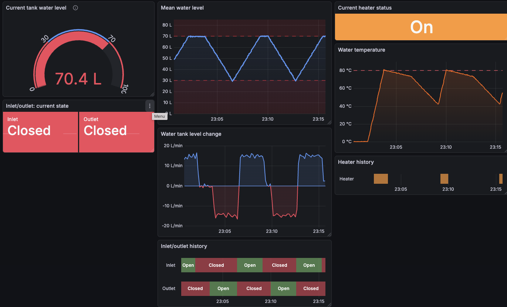
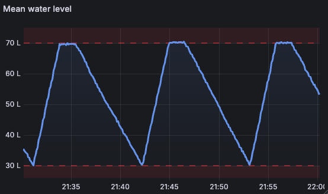
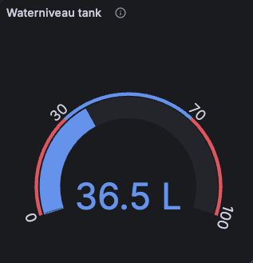
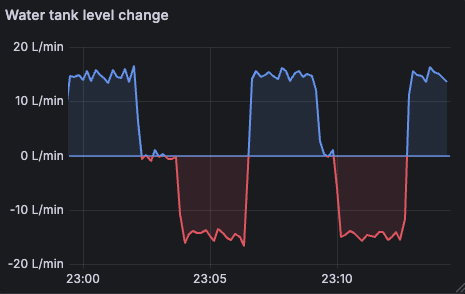
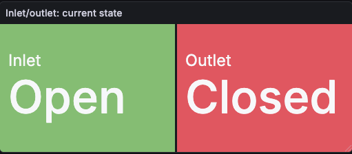
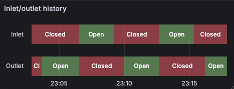

# Visualisatie met Grafana: oefeningen

## Setup

1. Clone deze repository

2. Open deze folder (`infm-grafana`) in VS Code

3. Open een terminal

4. Start de Docker containers met `docker compose up --build`.

    > Krijg je een foutmelding ivm `initial_sync`? Update je Docker-installatie naar de laatste versie.

Er worden 3 Docker containers opgezet:

- Grafana ([http://localhost:3000](http://localhost:3000))
- InfluxDB ([http://localhost:8086](http://localhost:8086))
- plcsim (een eenvoudige simulator die data van een boiler rechtstreeks wegschrijft in InfluxDB).

## Opgaven

1. Ga naar Grafana ([http://localhost:3000](http://localhost:3000)).
Log in met gebruikersnaam `admin` en wachtwoord `admin`. (Het aanpassen van het wachtwoord kan je overslaan).

2. Voeg een nieuwe InfluxDB data source toe met volgende configuratie-parameters:

   - query language `InfluxQL`
   - URL `http://influxdb:8086`
   - Database `timeseries`
   - User `admin`
   - Password `password`

3. Maak een nieuw dashboard, en voeg een visualisatie toe van **het gemiddelde waterniveau**. Voeg (met behulp van thresholds) ook lijnen toe die het gewenste niveau (tussen 30 en 70 liter) aangeven.

   

4. Voeg een Gauge-visualisatie toe van het **huidige (laatste) waterniveau**.

5. Verander de stijl hiervan zodat die er als volgt uitziet:

   

6. Voeg een grafiek toe die de gemiddelde *flow rate* (in liter/minuut) weergeeft van de tank, berekend per periode van 10 seconden.
   > Hint: deze data komt niet rechtstreeks uit de database. Gebruik de `DERIVATIVE` functie van InfluxQL om deze te berekenen. (De tijd-parameter van de DERIVATIVE-functie is de tijdseenheid voor de berekende rate, hier *per minuut* dus `1m`).

   Maak de grafiek zo duidelijk mogelijk (bv. eenheden, verschillende kleur voor positieve en negatieve waarden). Dat laatste kan je doen door de gradient mode op 'Scheme' te zetten, en als color scheme 'From thresholds' te kiezen, en de thresholds geschikt in te stellen.

   

7. Voeg een visualisatie toe van de meest recente toestand van de inlet en outlet. De toestand wordt in de data weergegeven als 0 of 1 (voor closed resp. open).
   
   > Hint: gebruik een Stat-element. De achtergrondkleur kan je dynamisch maken door 'Color mode' op 'Background color' te zetten. De tekst en kleuren kan je instellen via een value mapping.

   

8. Voeg een 'State graph' toe met de geschiedenis van de inlet- en outlet-toestand.

   

9. (extra) Voeg op het dashboard nog extra grafieken toe voor

   - de huidige watertemperatuur
   - het verloop van de watertemperatuur
   - de toestand van de brander

   Experimenteer met de verschillende opties om deze grafieken zo duidelijk mogelijk te maken.
